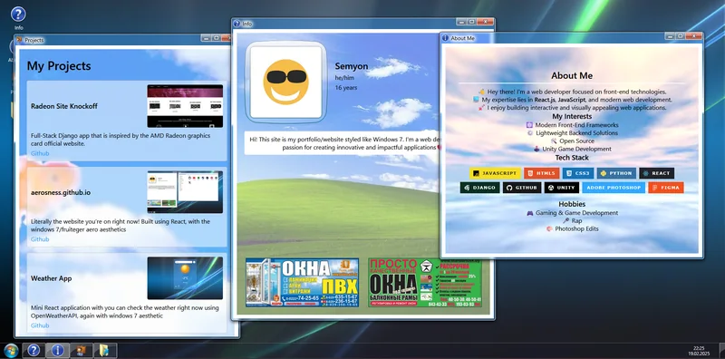

# Semyon Tyo — Windows 7 Portfolio

An interactive portfolio that turns a familiar Windows 7-style desktop into a
home for my projects, background, resume, and contact links. The interface is
built with React rather than being a static desktop mockup.

**Live site:** [aerosness.github.io](https://aerosness.github.io/)



## Highlights

- Desktop-style windows with familiar open, focus, minimize, maximize, and
  close interactions
- Start menu, taskbar, desktop shortcuts, and an optional startup experience
- Curated project case studies plus smaller experiments and game-jam work
- Responsive window content for desktop and mobile viewports
- Keyboard-friendly controls, semantic content, and reduced-motion support
- Locally served, optimized project imagery with no remote badge dependency

## Built with

- React 19
- Vite 6
- JavaScript, HTML, and CSS
- GitHub Pages

Portfolio copy and project details are centralized in
[`src/data/portfolio.js`](src/data/portfolio.js). Window content lives in
[`src/components/WindowContents`](src/components/WindowContents), while the
desktop shell and shared visual system live in [`src/App.jsx`](src/App.jsx) and
[`src/App.css`](src/App.css).

## Run locally

You will need a current Node.js LTS release and npm.

```bash
git clone https://github.com/aerosness/aerosness.github.io.git
cd aerosness.github.io
npm install
npm run dev
```

Vite will print the local preview address in the terminal.

## Quality checks

```bash
npm run lint
npm test
npm run build
```

Run all three in sequence with:

```bash
npm run check
```

## Deployment

The site is configured for GitHub Pages. To build and publish the `dist`
directory with the configured `gh-pages` workflow:

```bash
npm run deploy
```

## Inspiration and asset provenance

The web-desktop collection at
[simone.computer](https://simone.computer/#/webdesktops) was an important source
of inspiration for the format.

This is an independent portfolio homage and is not affiliated with or endorsed
by Microsoft. Windows, Windows 7, and related product imagery and trade dress
belong to Microsoft. Other product names and logos belong to their respective
owners.

Some visual and audio files under `public/resources` reference or may originate
from third-party products and sources. They are included here for portfolio and
demonstration purposes; authorship or redistribution rights are not claimed.
Before reusing or redistributing this project, audit those files and replace
them with assets you own or have permission to use.
